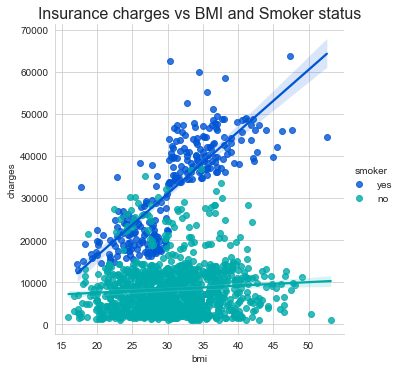
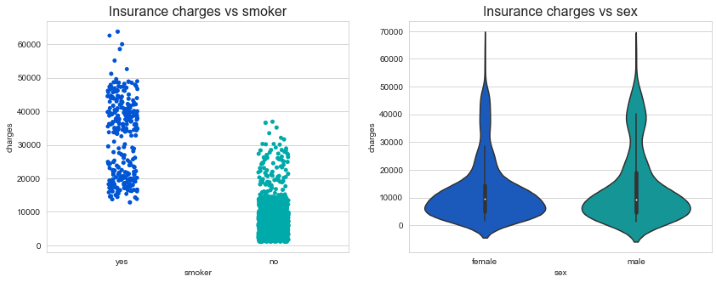

# Health Insurance Prediction

## Overview
This project contains data visualization, feature engineering and building a linear regression model for predicting insurance costs using medical personal expenses billed by a health insurance company.

## Resources Used
- Python 3.7
- Numpy and Pandas for data manipulation
- Matplotlib and Seaborn for data visualization
- scipy.stats for feature scaling
- sklearn for train_test_split data, and building and evaluating the regression models

## Dataset
The Insurance dataset has 1338 observations and 7 attributes and contains medical personal costs billed by a health insurance company:

- age: Age of primary beneficiary
- sex: Insurance contractor gender, female, male
- bmi: Body Mass Index, providing an understanding of body, weights that are relatively high or low relative to height, objective index of body weight (kg/m^2) using the ratio of height to weight, ideally 18.5 to 24.9
- children: Number of children covered by health insurance / Number of dependents
- smoker: Smoking
- region: The beneficiary's residential area in the US, northeast, southeast, southwest, northwest.
- charges: Individual medical costs billed by health insurance

## Data Visualization and Analysis
While conducting data visualization I looked for answers to the following questions:

- How does smoking affects the relationship between BMI and insurance costs?
- How are the insurance costs influenced by age, gender, and smoking?
- Are the insurance charges influenced by the number of dependents or regions?

I made the following visualizations:
- Distributions of insurance charges and BMI
- Boxplot of BMI and visualized the outliers
- Use a lmplot to examine the linear relationship between Insurance charges and BMI by smoker status and plot the regression lines
- Explore the relationships between insurance charges and age, smoker status, sex, number of children and region using scatterplots, strip plots, violin and box plots and bar plots.

Some of the visualizations are presented below:

 

 

## Data Preprocessing
- Remove duplicates
- Check for missing values
- Detect and remove outliers
- Discretization: bin variables
- Category encoding using one-hot encoding
- Normalize features
- Split the data into training and testing sets

## Build Regression Models
Using scikit-learn, I built several models to predict the insurance costs and evaluate their fit. 

The models that I built are Linear Regression, Random Forest, and Polynomial Regression. 
For each model it was determined:
-	the intercept and the coefficients
-	evaluation metrics:  mean absolute error (MAE), mean squared error (MSE), root mean square error (RMSE) and the coefficient of determination (R2 score). 

Polynomial Regression model predicted the best patient's insurance costs, having the highest R2 score of all models.

